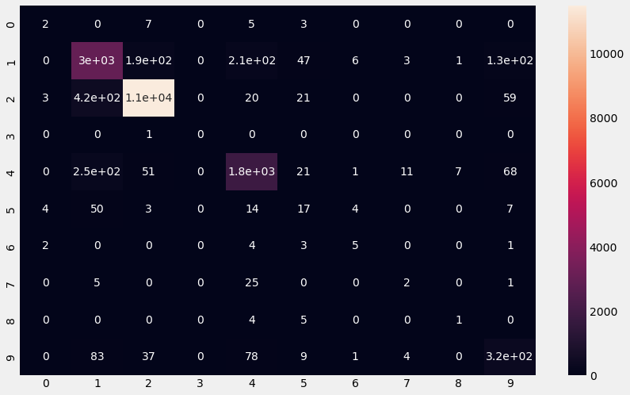
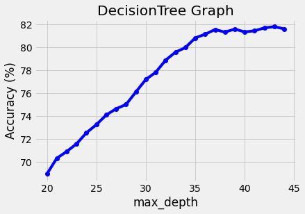
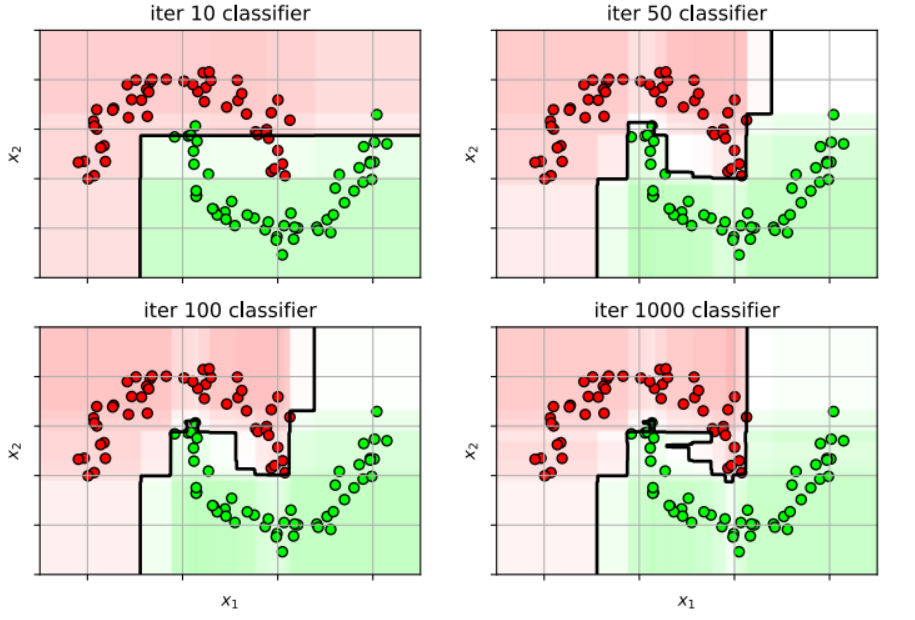
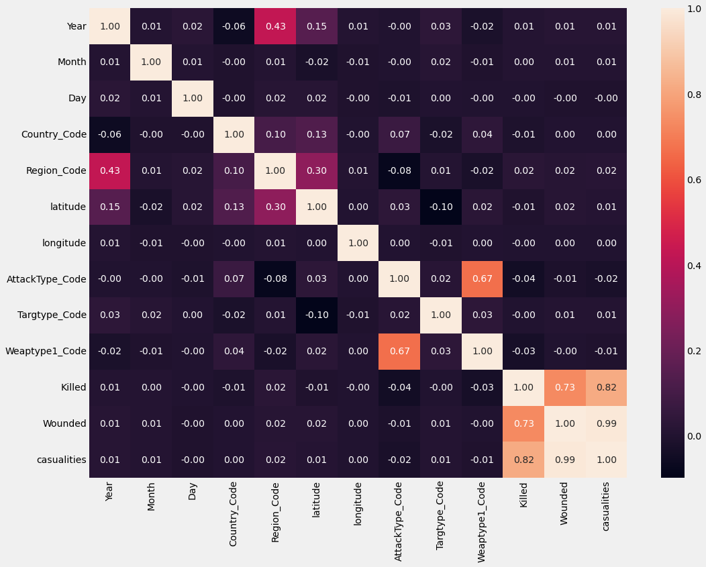

---
jupytext:
  text_representation:
    extension: .md
    format_name: myst
kernelspec:
  display_name: Python 3
  language: python
  name: python3
---

# Build models

In this part, we build three models to predict:
- The weapon types (KNN Algorithm)  
- The terrorist groups (Decsion Tree Algorithm)  
- The property damage (XGBoost Algorithm)  


## KNN Algorithm

The k-nearest neighbors (KNN) algorithm is a simple, supervised machine learning algorithm that can be used to solve both classification and regression problems.  
  
The algorithm is based on the principle that similar data points (i.e. data points that are nearby in space) tend to have similar labels (i.e. they tend to belong to the same class). Therefore, the KNN algorithm can be used to predict the label of a new data point by looking at the labels of the data points that are nearby in space.  
### How the KNN work
- Using KNN to cluster the new example, let's set K=3
- Choose 3 neareast neighbors 
- The example will belong to the cluster which has a higher proportion


### Prediction of the weapon types
- We encapsulated the prediction by using k-nearest neighbors (KNN) algorithm in the function of call_knn().  
- In this function, we split the original dataset into X_train, X_test, y_train, y_test at test_size = 0.33 and random_state =15.  
- And then, we using the RandomOverSampler function to deal with the imbalaenced dataset, which supports multi-class resampling by sampling each class independently. Supports heterogeneous data as object array containing string and numeric data.
- We also used StandardScaler() to help to get standardized distribution, with a zero mean and standard deviation of one (unit variance). It standardizes features by subtracting the mean value from the feature and then dividing the result by feature standard deviation.
- After that, we collected all the output accuracy_score and different numebr of neighbors form 1 to 31 in the list named graph.
- We selected the Maximum Accuracy of the increasing neighbors of KNN algorithm.


```{code-block} 
from imblearn.over_sampling import RandomOverSampler
def call_knn(X,y):
  
    X_train, X_test, y_train, y_test = train_test_split(X, y, test_size = 0.33, random_state = 15)
    ros = RandomOverSampler(random_state=0)
    X_train, y_train = ros.fit_resample(X_train, y_train)
    ss = StandardScaler()
    X_train = ss.fit_transform(X_train)
    X_test = ss.transform(X_test)
  
    graph = {}
#     yPred =   {}
    for i in range(1,31):
    
        classifier = KNeighborsClassifier(n_neighbors = i)
        classifier.fit(X_train, y_train)
        y_pred = classifier.predict(X_test)
        ac = accuracy_score(y_test,y_pred)
#         ac = precision_score(y_test,y_pred,average='macro')
        graph[i] = ac*100
#         yPred[i] = y_pred
    
    plt.plot(list(graph.keys()), list(graph.values()),color='blue', marker='o')
    plt.title('KNN Graph')
    plt.xlabel('neighbour')
    plt.ylabel('Accuracy (%)')
    plt.show()

    max_key = max(graph, key=graph.get)
    print("We got Maximum Accuracy of",graph[max_key],'% at k = ',max_key)
    plt.subplots(figsize=(13,8))
    sns.heatmap(confusion_matrix(y_test, y_pred), annot=True)
    plt.show()
```

```{code-block}
X = terror.iloc[:,[3,10,12]].values
y = terror.iloc[:, 15].values

call_knn(X,y)
```

  
We got Maximum Accuracy of 90.5160315232646 % at k =  7



### Prediction results
According to the output images and accuracy above, we could find that the maximum accuracy of KNN algorithm is 90.5160315232646 % at the number of the neighbors is 7.  
From KNN Graph, when the number of neighbors is smaller than 5, the increasing accuracy will be associated with rising numbers of the neighbors. After the number of the neighbors bigger that 15, then the accuracy will decrease associated with the rising number of the neighbors.  
As for the second graph, which is a heatmap of the confusion matrix of the prediction result and actual labels, contains the correlation  of each features of the dataset. For instance, the weapon types is highly related to the group of terrorist who launch an attack.  


## Decision Tree Algorithm
Decision Tree Analysis is a general, predictive modelling tool with applications spanning several different areas. In general, decision trees are constructed via an algorithmic approach that identifies ways to split a data set based on various conditions. It is one of the most widely used and practical methods for supervised learning. Decision Trees are a non-parametric supervised learning method used for both classification and regression tasks. The goal is to create a model that predicts the value of a target variable by learning simple decision rules inferred from the data features.  

### How decision tree work
- Simple "Rule-based" classifier
    - At each node, move down the tree based on the node's criteria.
    - leaf node contains the prediction
- Advantage: can create complex conjunction of rules
- Disadvantage: easy to overfit by itself

 

### Prediction of the terrorist group
Firstly, we selected the related features of the prediction values, there are "Year","Region_Name","Country_Name","AttackType_Name","casualities","Targtype_Name" and "Weaptype1_Name" respectively. The value we need to predict is "Group_name".  
We selected the top 100 terrorist group in the statistics.  
Before we fit the model, we pre-process the each columns of the dataset to replace the black space in the string.  
After that, we used one-hot to encode the input features. And split the dataset into  X_train, X_test, y_train and y_test with test_size=0.33 and random_state =15.  
Finally, We also used StandardScaler() to help to get standardized distribution, with a zero mean and standard deviation of one (unit variance). It standardizes features by subtracting the mean value from the feature and then dividing the result by feature standard deviation.

```{code-block}
from sklearn.tree import DecisionTreeClassifier
from sklearn.metrics import confusion_matrix
x_features = ["Year","Region_Name","Country_Name","AttackType_Name","casualities","Targtype_Name","Weaptype1_Name"]
y_features=["Group_Name"]
terrortop10 = terror[terror['Group_Name'].isin(terror['Group_Name'].value_counts()[1:100].index)]
X = terrortop10[x_features]
Y = terrortop10[y_features]
X.columns = X.columns.str.replace(' ', '')
Y.columns = Y.columns.str.replace(' ', '')
X_onehot = pd.get_dummies(X)
X_train, X_test, y_train, y_test = train_test_split(X_onehot, Y, test_size=0.33, random_state=15)
X_train.columns = X_train.columns.str.replace(' ', '')
X_test.columns = X_test.columns.str.replace(' ', '')
y_train.columns = y_train.columns.str.replace(' ', '')
y_test.columns = y_test.columns.str.replace(' ', '')
ss = StandardScaler()
X_train = ss.fit_transform(X_train)
X_test = ss.transform(X_test)
```

We encapsulated the prediction by using Decision Tree Classifier in the function of call_knn().  
In this function, we collected all the output accuracy score and the increasing number of  max_depth form 20 to 45 in the list named graph.  
Furthermore, we also calculate the values of the precision score, recall score and the f1 score.    
AS the database is unbalanced determined by the realistic factors, so that the value of recall and f1 will be a little bit lower than the accuracy.  

```{code-block}
def call_dtc():
    graph = {}
    yPred= {}
    for i in range(20,45):
        clf = DecisionTreeClassifier(max_depth = i)
        clf.fit(X_train, y_train)
        y_pred = clf.predict(X_test)
        ac = accuracy_score(y_test,y_pred)
        graph[i] = ac*100
        yPred[i] = y_pred
    plt.plot(list(graph.keys()), list(graph.values()),color='blue', marker='o')
    plt.title('DecisionTree Graph')
    plt.xlabel('max_depth')
    plt.ylabel('Accuracy (%)')
    plt.show()
    max_key = max(graph, key=graph.get)
    print("We got Maximum Accuracy of",graph[max_key],'% at k = ',max_key)
    print("We got precision of",precision_score(y_test, yPred[max_key], average='macro'))
    print("We got recall of",recall_score(y_test, yPred[max_key], average='macro'))
    print("We got f1 of",f1_score(y_test, yPred[max_key], average='macro'))
```

```{code-block}
    call_dtc()
```

 

We got Maximum Accuracy of 81.80973862279421 % at k =  43  
We got precision of 0.7055390136508586 %  
We got recall of 0.6816275853616648 %  
We got f1 of 0.6864148871893768 %  

### Prediction results
According to the output images and accuracy above, we could find that the maximum accuracy of Decision Tree Algorithm is 81.80973862279421 % at the max_depth = 43.  
From Decision Tree Graph, when the value of max_depth is smaller than 35, the increasing accuracy will be associated with rising depth of the tree. After the number of the neighbors bigger that 35, then the accuracy will stable associated with the rising number of the depth of the tree. 


## XGBboost Algorithm

The XGBoost is having a tree learning algorithm as well as linear model learning, and because of that, it is able to do parallel computation on a single machine. This makes it 10 times faster than any of the existing gradient boosting algorithms.  
The XGBoost and the GBMs (i.e. Gradient Boosting Machines) uses tree methods by using the gradient descent architecture. The area where XGBoost leaves the other GBMs behind is the area of system optimization and enhancements over the algorithms.  

### How xgbboost works
- Combine the outputs of many "weak" classifiers to make a "strong" classifier
- Training:
    - In each iteration,
        - training data is re-weighted based on whether it is correctly classified or not.
        - weak classifier focuses on misclassified data from previous iterations.
    - Use cross-validation to pick number of weak learners.

 

### Prediction of the property damage of different terrorist attacks

```{code-block}
import xgboost as xgb
from xgboost import XGBClassifier
x_features = ["Year","Region_Name","Country_Name","AttackType_Name","casualities","Targtype_Name","Weaptype1_Name","Group_Name"]
y_features=["Property_Damage"]
terror_dmg=terrortop10[terrortop10.Property_Damage !="none"]
# terror_dmg=terrortop10[terrortop10.Property_Damage]
X_dmg = terror_dmg[x_features]
Y_dmg = terror_dmg[y_features]

X_onehot = pd.get_dummies(X_dmg)

X_train, X_test, y_train, y_test = train_test_split(X_onehot, Y_dmg, test_size=0.33, random_state=15)

X_train.columns = X_train.columns.str.replace(' ', '')
X_test.columns = X_test.columns.str.replace(' ', '')
y_train.columns = y_train.columns.str.replace(' ', '')
y_test.columns = y_test.columns.str.replace(' ', '')

model4 = XGBClassifier(n_estimators=500, max_depth=10, learning_rate=0.01, subsample=0.6)
trained2 = model4.fit(X_train,y_train)
pred2 = trained2.predict(X_test)
print('XGboost Accuracy %r' % (accuracy_score(y_test, pred2) * 100))
print("We got precision of",precision_score(y_test, pred2, average='macro'))
print("We got recall of",recall_score(y_test, pred2, average='macro'))
print("We got f1 of",f1_score(y_test, pred2, average='macro'))
```

XGboost Accuracy 79.6072707973995  
We got precision of 0.7943380233064116  
We got recall of 0.5527717356334841  
We got f1 of 0.5946181569403814  

```{code-block}
from numpy import array
import pandas as pd
import seaborn as sns
from matplotlib import pyplot as plt

plt.figure(figsize=(16,12))
sns.heatmap(terror.corr(),annot=True,fmt=".2f")
plt.show()
```

The picture below shows the correlation between the different features in the database. Compared with the predictions above, the related features can be supported as the input data and the performance of the predictions are not bad.
 

