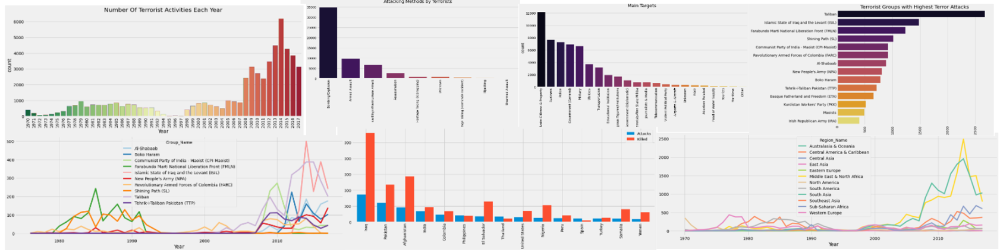
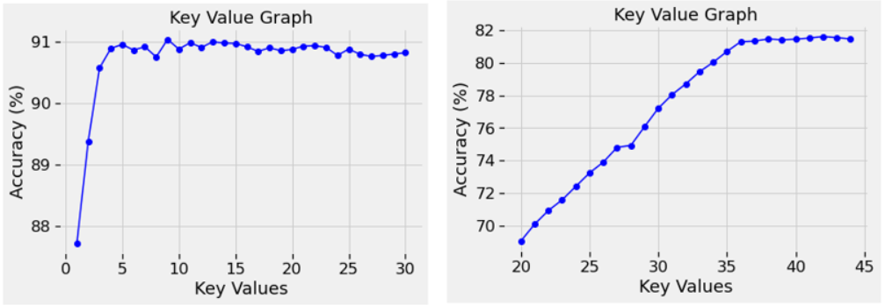

---
jupytext:
  text_representation:
    extension: .md
    format_name: myst
kernelspec:
  display_name: Python 3
  language: python
  name: python3
---

# Conclusion

To make the conclusion, we used the exploratory data analysis to find the relationship between the different features. We can understand the relationship and regular between the various features of data from different terrorist attacks, for example, we can know Iraq is the largest country with terrorism incidents. As a result, we can prevent the terrorist attacks more directly and have a information about the risky of different regions to help them decided wheather to build a better military protection.  
  

  
The core of machine learning is deep learning. Through continuous model training and prediction, the value of machine learning is becoming more and more obvious, and deep learning technology plays an increasingly important role in contemporary society. While the predictive performance of machine learning algorithms in regions more affected by terrorism is relatively high, predicting events in regions that have not experienced terrorism for a long time remains challenging. Algorithms may exhibit relatively good overall accuracy even at fine spatial and temporal resolutions.

According to the findings, we use three different algorithms to predict the weapon type, the terrorist group and the property damage, there are knn, dst and xgboost respectively. We can have a precition on each feature of our terror data base on other different features. In addition to disagreement among scholars on the definition of terrorism, the availability, spatiotemporal coverage, and quality of publicly available data on terrorism and its underlying drivers remain important barriers to accurate predictions of terrorism on a global scale and at policy-relevant scales . But terrorism data and socioeconomic drivers are becoming increasingly detailed, comprehensive and accessible. Furthermore, the continued development of interpretable machine learning algorithms is very promising and will make these powerful tools more accessible to the research community and practitioners in the years to come.  

  
As for the reality meaning, we thought our prediction can be regard as an early warning tool because it can not only help governments save huge costs associated with fighting terrorist groups, but also focus their efforts on the most destructive terrorist groups.

