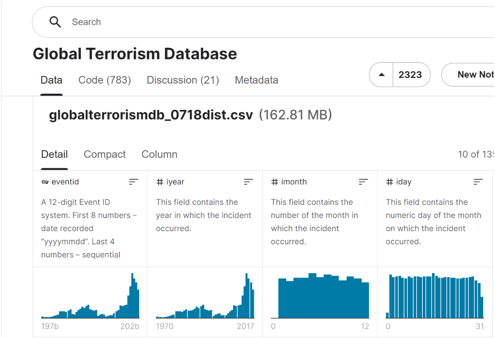
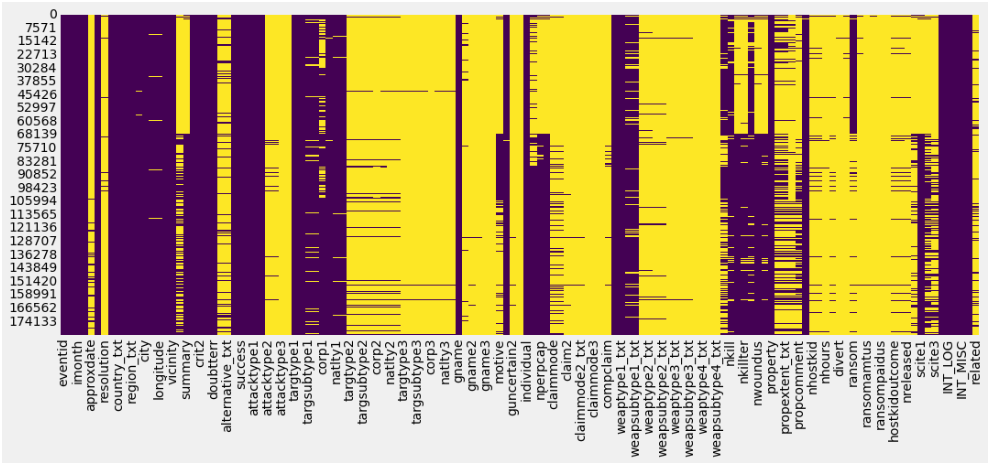
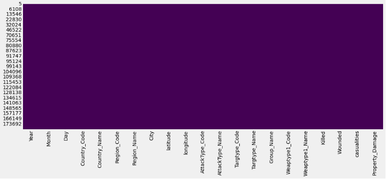

---
jupytext:
  text_representation:
    extension: .md
    format_name: myst
kernelspec:
  display_name: Python 3
  language: python
  name: python3
---

(data_process)=

# Data Processing 

## Database of our project

The Global Terrorism Database (GTD) is an open-source database including information on terrorist attacks around the world from 1970 through 2017 (with annual updates planned for the future). The GTD includes systematic data on domestic as well as international terrorist incidents that have occurred during this time period and now includes more than 170,000 cases. The database is maintained by researchers at the National Consortium for the Study of Terrorism and Responses to Terrorism (START), headquartered at the University of Maryland.

Based on 46 years data obtained from The Global Terrorism Database (GTD), we can catch these following facts: Iraq is the largest country with terrorism incidents (22130 incidents).
Andorra, Antigua and Barbuda, Brunei, Falkland Islands, New Hebrides, North Korea, South Vietnam, St. Lucia, Vatican, Wallis and Futuna are the safest countries with only 1 incident from 1970 - 2016. The top 10 countries with the most terrorism incidents, there are 2 countries from Europe: United Kingdom and Turkey.

The Global Terrorism Database(GTD)


### Rename the tags of the data and check the missing values
```{code-block}
terror = pd.read_csv("globaldata.csv",encoding='ISO-8859-1')
plt.figure(figsize=(16,6))
sns.heatmap(terror.isnull(),cmap='viridis',cbar=False)
terror.rename(columns={'iyear':'Year','imonth':'Month','iday':'Day','country':'Country_Code','country_txt':'Country_Name','region':'Region_Code','region_txt':'Region_Name','city':'City','attacktype1':'AttackType_Code','attacktype1_txt':'AttackType_Name','targtype1':'Targtype_Code','targtype1_txt':'Targtype_Name','gname':'Group_Name','weaptype1':'Weaptype1_Code','weaptype1_txt':'Weaptype1_Name','nkill':'Killed','nwound':'Wounded','propextent_txt':'Property_Damage'},inplace=True)
terror['casualities']=terror['Killed']+terror['Wounded']
terror=terror[['Year','Month','Day','Country_Code','Country_Name','Region_Code','Region_Name','City','latitude','longitude','AttackType_Code','AttackType_Name','Targtype_Code','Targtype_Name','Group_Name','Weaptype1_Code','Weaptype1_Name','Killed','Wounded','casualities','Property_Damage']]

```


```{code-block} 
terror = terror.dropna()
terror.head(5)
plt.figure(figsize=(16,6))
sns.heatmap(terror.isnull(),cmap='viridis',cbar=False)
```
The image above shows the heatmap of the database before we drop the null value of the feature, the yellow part represent for the missing values. According to our calculation, the volume of the data we dropped, is too small compared with the whole dataset. So that we thought it would not influence the performance of our prediction. 



After the pre-processing, the whole heatmap became purple, so that we got the database without missing values.
