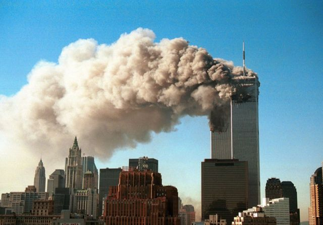

---
jupytext:
  text_representation:
    extension: .md
    format_name: myst
kernelspec:
  display_name: Python 3
  language: python
  name: python3
---

(introduction_of_database)=

# Introduction of Background

Since the "9.11" terrorist attack in the United States in 2001, terrorist activities have not been suppressed or reversed worldwide. Terrorism seriously threatens the security and stability of all countries. Since the US launched the Iraq War in 2003, terrorist attacks have intensified around the world, and countries have also incorporated the fight against terrorism into the strategic level of national security. Based on the background of global anti-terrorism, our project studies the basic characteristics of terrorist attacks in the past 30 years by analyzing the characteristics and changing trends of terrorist attacks.
    
Terrorism is the threatened or actual use of illegal force and violence by a non-state actor to attain a political, economic, religious, or social goal through fear, coercion, or intimidation. Terrorism indeed overshadows every aspects of economic, social, cultural and political life. While it bring instability and disrupts peace and coexistence environment, it directly endangers the lives of people and brings every types of violence in the society.
        
Every year, terrorist attacks make a considerable impact on the world’s economy. According to the 2017 Global Terrorism Index, the impact fell by seven percent in 2016, the second year in succession that it declined. Despite the decline, costs still reached a grim 84 billion last year.Since the attacks on 9/11 , economic losses from terrorism generally fluctuated before reaching 41 billion in 2007 ,primarily as a result of violence in Iraq.Amid the rise of ISIS, there was a further surge in losses since 2012 and they reached a peak of 104 billion in 2014.  
  
    

  
    

